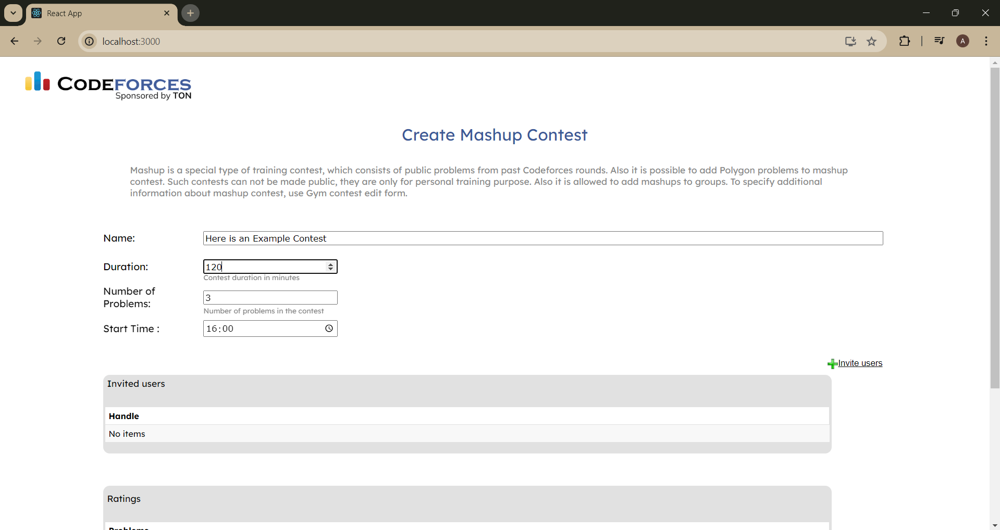
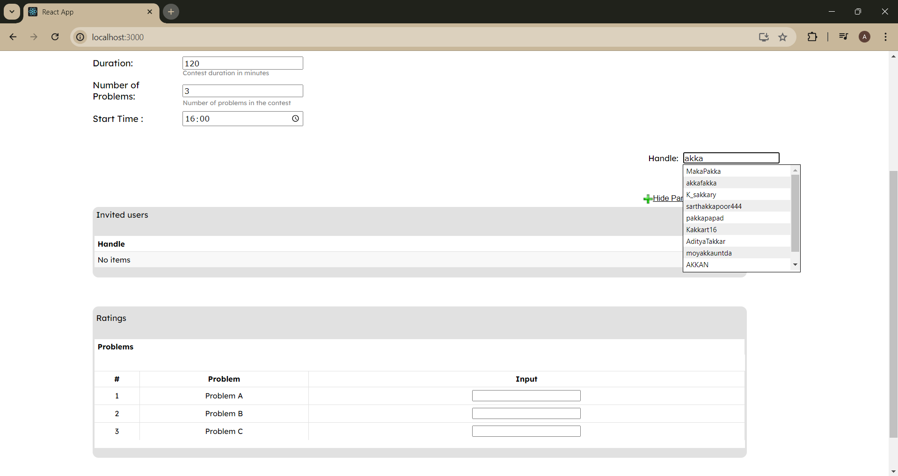
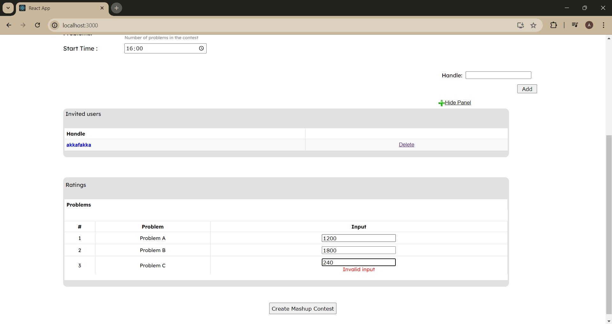
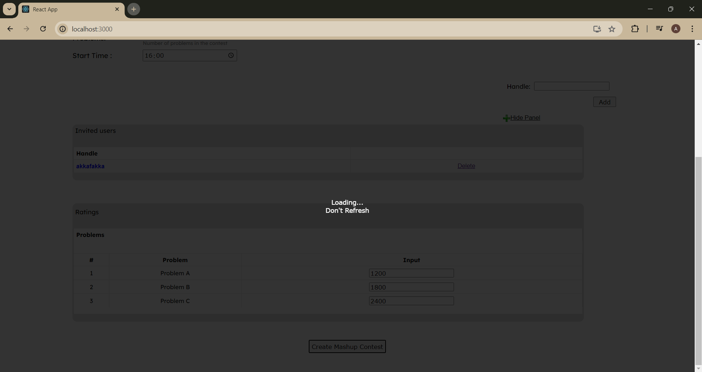
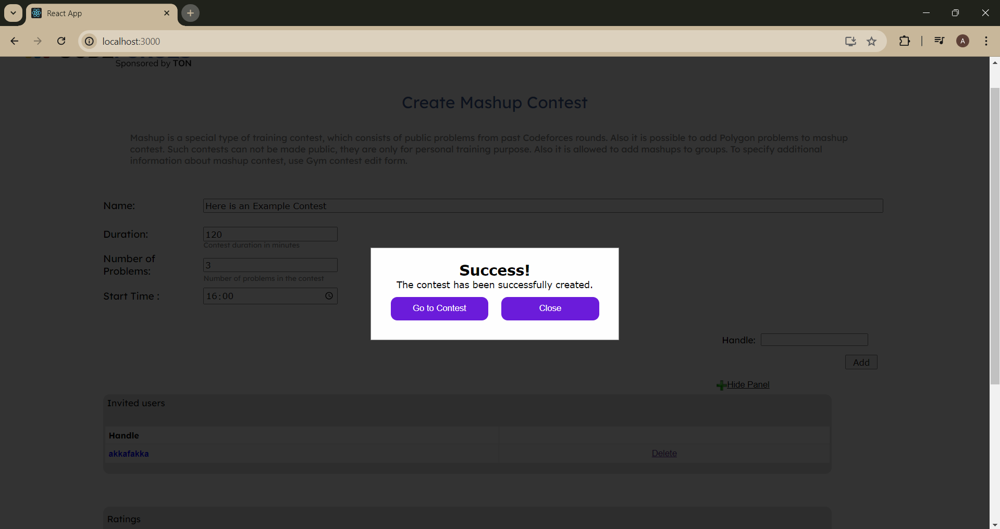

<p align="center">
  <a href="" rel="noopener">
 </a>
</p>

<h3 align="center">Codeforces Mashup Generator</h3>

---

<p align="center"> Have you ever needed a solution for targeted practice sessions on this wonderful site? Look no further — here is a comprehensive solution to meet all your needs...
    <br> 
</p>

## 📝 Table of Contents

- [About](#about)
- [Getting Started](#getting_started)
- [Deployment](#deployment)
- [Usage](#usage)
- [Built Using](#built_using)
- [TODO](../TODO.md)
- [Contributing](../CONTRIBUTING.md)
- [Authors](#authors)
- [Acknowledgments](#acknowledgement)

## 🧐 About <a name = "about"></a>


This project facilitates proctoring targeted practice sessions on [Codeforces](https://codeforces.com/). It allows you and your friends to create custom mashup contests using problems from the Codeforces problem set that are unsolved by all participants.

Additionally, it offers the option to select the number of questions you need and the difficulty level of each question, randomized from the set of all unsolved problems.

In the background, the application utilizes the [Selenium](https://www.selenium.dev/) web scraper to gather data from the Codeforces [mashup](https://codeforces.com/mashup/new) site, automatically filling in information based on user input.

Take a look at the project ...

## 🏁 Getting Started <a name = "getting_started"></a>

These instructions will get you a copy of the project up and running on your local machine for development and testing purposes. 

### Prerequisites

Open your terminal or command prompt in the working directory and run 

```
pip install -r requirements.txt
```

### Installing

Firstly clone the repository to your local machine by running the following command in git bash

```
git clone https://github.com/anub-dota/MashupGeneratorCF
```

Get in the working directory and open two powershell terminals

- Open the React development environment from [frontend](/frontend/)

```
cd frontend

npm start
```

- Open backend [Flask](https://flask.palletsprojects.com/en/3.0.x/) server on another terminal

```
cd backend

python main.py
```


## 🎈 Usage <a name="usage"></a>

After running the above commands go to 
```
http://localhost:3000/
```

Now lets make a sample contest.

Here is a thorough walkthrough.










## ⛏️ Built Using <a name = "built_using"></a>

- [React](https://react.dev/) - Web Frontend Framework
- [Flask](https://flask.palletsprojects.com/en/3.0.x/) - Server Framework
- [Selenium](https://www.selenium.dev/) - Web Scraper

## ✍️ Authors <a name = "authors"></a>

- [Akansh Khandelwal](https://github.com/AkanshKh)
- [Anubhab Dutta](https://github.com/anub-dota) 


## 🎉 Acknowledgements <a name = "acknowledgement"></a>

- Mike Mirzayanov for [this](https://codeforces.com/) wonderful site
